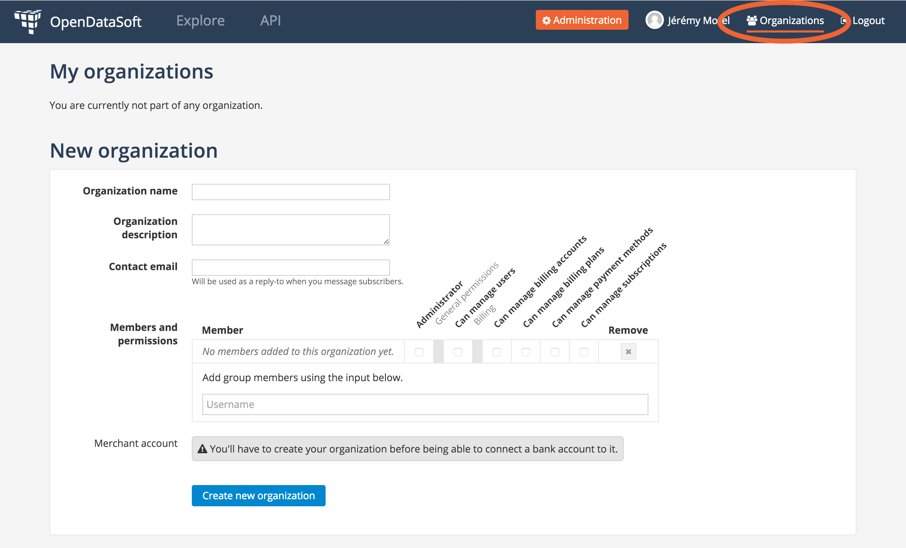
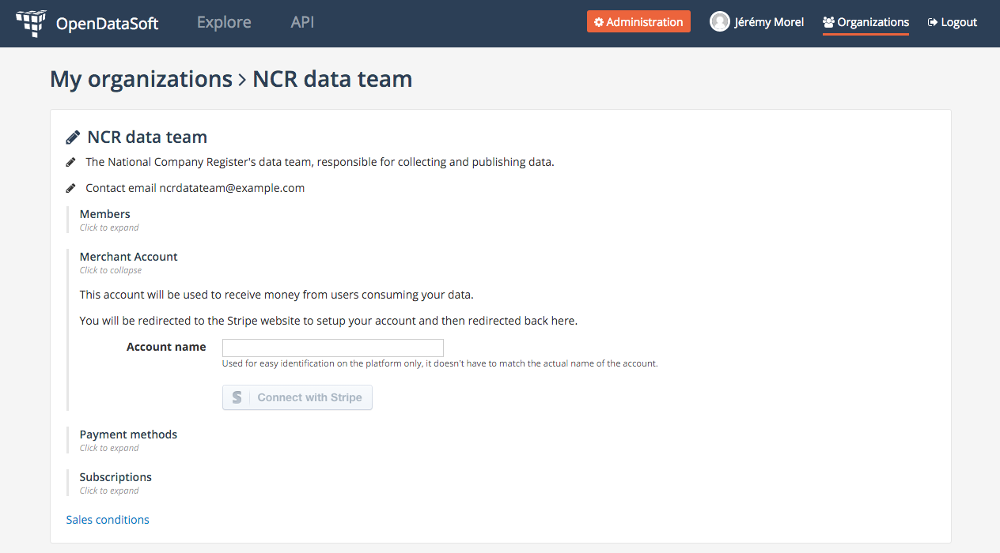
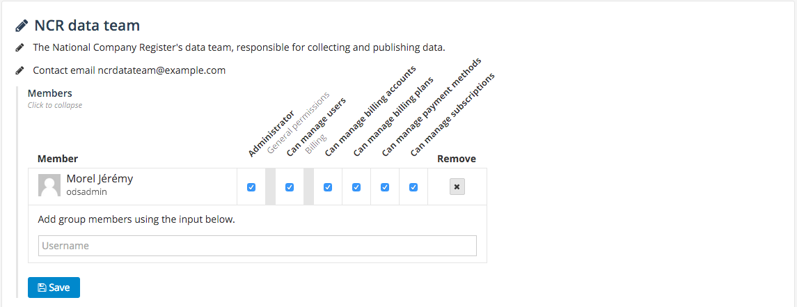
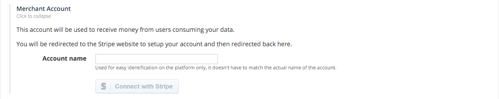
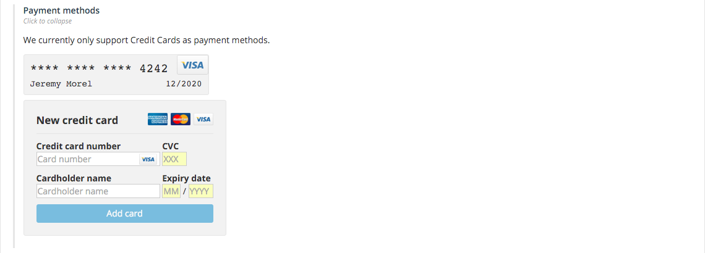

Organizations
=============

.. important::
   The billing feature is currently in private beta and therefore isn't available on all domains. If you'd like to
   take part in this beta, drop us an email at `support@opendatasoft.com <support@opendatasoft.com>`_.

When using the billing feature of the OpenDataSoft platform, the first step is always to create an organization.

Creating an organization
------------------------

Organizations can be created by anybody having an account on the OpenDataSoft platform. Just like accounts,
organizations are available from all domains on the OpenDataSoft platform, provided that these domains have the billing
feature activated (if they don't then organizations do no have any purpose). If the domain has the billing feature,
you'll see the organization link right next to your profile link in the menu.

.. note::
   While we plan on opening organizations to anybody, at the moment only domain administrators can create organizations.
   These organizations are not limited to the domain they were created on though, they will be accessible on any domain
   of the OpenDataSoft's network that has the billing feature activated.

Under the *New organization* section you'll find a form requesting a name, description and contact email address.
Though you can already add members, it is not required. You will be automatically added to the organization as
administrator.

Once you submit the form, you'll be taken to a new page dedicated to your new organization. Since you're the
administrator you'll be able to edit the organization's properties (name, description, contact email),
manage the members, connect a merchant account, connect credit cards and follow both your organization's subscriptions
and plans (you'll be available to see subscriptions to your plans and the revenue they generate).

Members management
------------------

Using this form, you'll be able to add members to your organization and give them permissions. The full list of
permissions is detailed in the :ref:`introduction <organizations-permissions>`.

Merchant account
----------------

A merchant account is rather simply a link to a bank account. Connecting a bank account to your organization will
enable organization members to create paid plans on their own datasets, the revenue of which will be collected on the
given bank account.

You do not need to set up a merchant account if you do not plan on setting up paid plans.

   Use the *Connect with Stripe* button to link a bank account.

We do not store any information related to your bank account on our servers. We delegate this responsibility to our
payment processing service, `Stripe <http://stripe.com>`_. To connect a bank account, you'll therefore be redirected
first on Stripe's account creation page before returning to your organization's page. Since you'll be creating a
full-fledged account on Stripe's platform, you'll retain full control over all occurring operations.

.. figure:: organizations__stripe-form--fr.png

   Stripe's account form

Plans and revenue
^^^^^^^^^^^^^^^^^

Once you've connected a bank account to your organization, you'll see a new section bearing the name of your merchant
account on your organization's page. If you expand this new section, you'll see a summary of all the active plans
linked to the merchant account, the related subscribers (if there are any) and the global revenue generated.

.. figure:: organizations__plans-revenue--en.png

   The plans and revenue subscription after the creation of our first plan (see :doc:`plans`).

Payment methods
---------------

OpenDataSoft's currently only supports credit cards as payment methods. Using this form, you'll be able to set-up
multiple credit cards for your organizations. These credit cards do not have to be linked to the bank account used for
your merchant account.

The authorized members will then be able to use these credit cards to subscribe to plans.

Subscriptions
-------------

Your organization's page also has a subscription sections that lists all active and cancelled subscriptions. This is
where you'll be able to retrieve your invoices.

For more information, see the dedicated :doc:`subscriptions` page.
