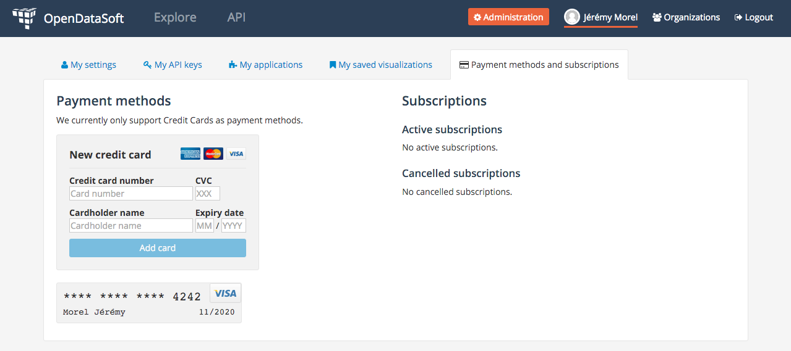
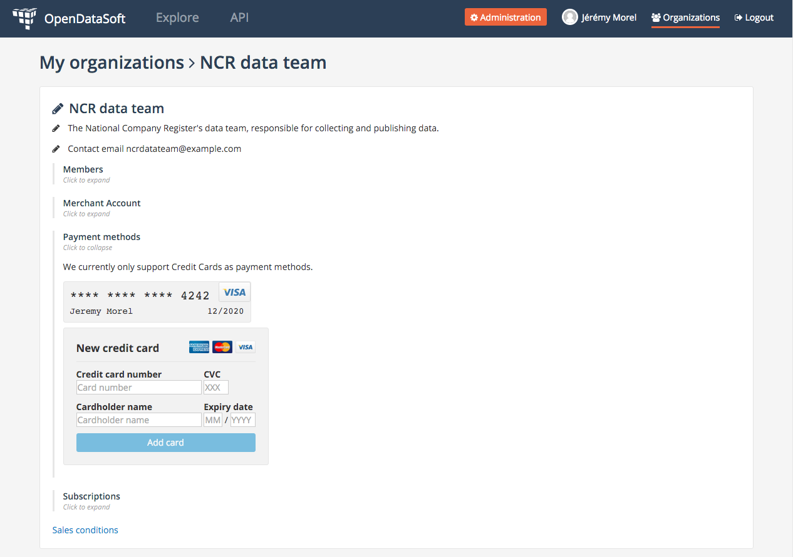

Payment methods
===============

.. important::
   The billing feature is currently in private beta and therefore isn't available on all domains. If you'd like to
   take part in this beta, drop us an email at `support@opendatasoft.com <support@opendatasoft.com>`_.

The OpenDataSoft platform currently only supports credit cards as payment method. We support all major credit card
providers (Visa, Mastercard, etc.). These credit cards can be used to subscribe to any data plan.

You can set up credit cards either for yourself as an individual or for each of your organizations (provided that you
have sufficient permissions). The interface in both cases is the same, but the scope is different.

* If you set up a credit card in your profile, you will be the only person able to use this card to subscribe to plans,
  and you'll be the sole beneficiary of these subscriptions.
* If you set up a credit card in an organization's page, all members of said organization with the
  ``manage_subscriptions`` permission will be able to use said card to subscribe to plans. Similarly, any subscription
  made using this card will provide access to the related data to all members of the organization.

   The payment methods interface on your profile page.

   The payment methods interface on an organization page.

