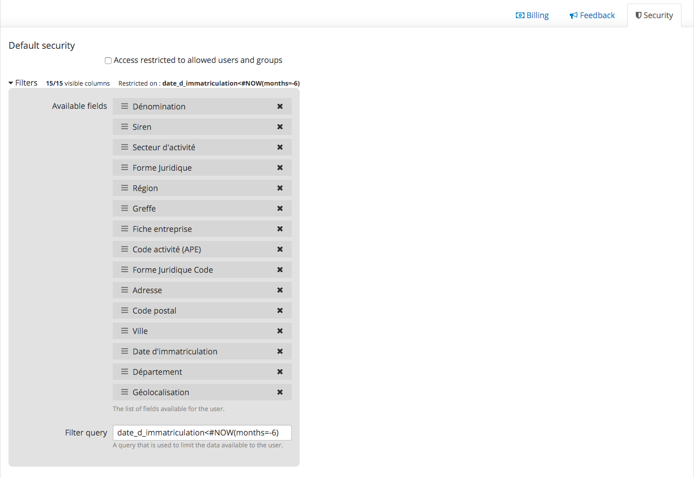
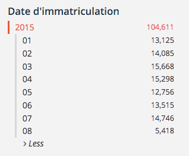
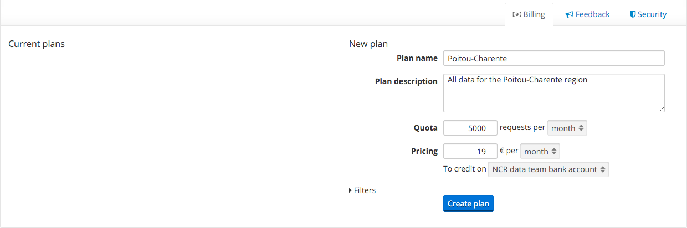
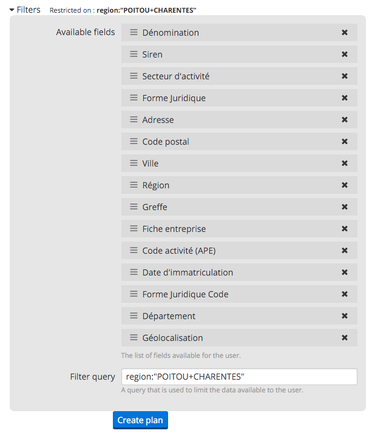
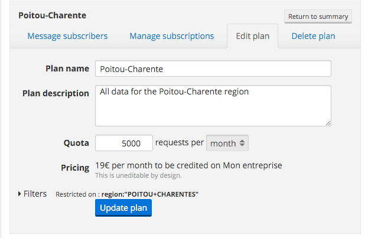
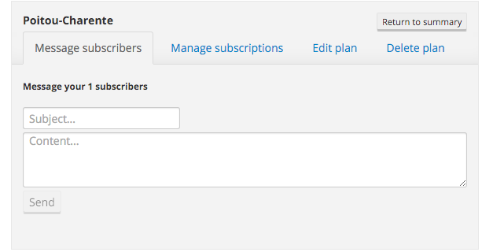
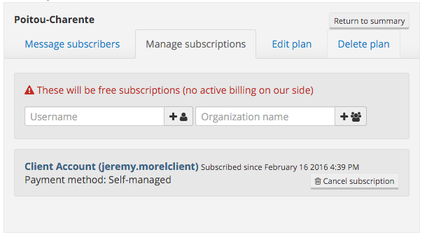
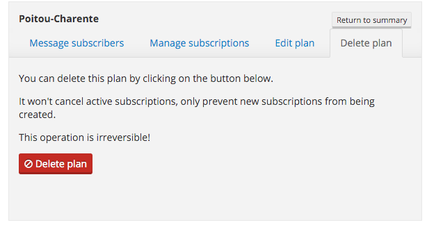

Plans
=====

.. important::
   The billing feature is currently in private beta and therefore isn't available on all domains. If you'd like to
   take part in this beta, drop us an email at `support@opendatasoft.com <support@opendatasoft.com>`_.

In this section, we'll assume the identity of the National Company Register. We are publishing a dataset containing all
company registrations and want the following setup:

* anybody can see company registrations except for those of the last 6 months.
* :doc:`organizations` can subscription to plans providing daily update on company registrations region by region.

Global security
---------------

Before publishing the dataset, the first step is to make sure that it will be discoverable and that nobody can see data
from the last 6 months.

   In order to prevent users from viewing data from the last 6 months, we simply setup the following rule:
   ``date_d_immatriculation<#NOW(months=-6)`` (``date_d_immatriculation`` being the registration date field).

Since we didn't check the *Access restricted to allowed users and groups*, the dataset is public but as of now, nobody
but the data publisher can see records for company registrations in the last 6 months.

   The registration dates visible for an anonymous user once we set up the global security.

Per-region plans
----------------

We'll now setup our very first plan. It will cost 19€ a month a will contain all data related to the *Poitou-Charente*
region in France.

We have to go to the *Billing* tab of the dataset's in the backoffice to set up such a plan.

   Basic setup for the new plan.

When setting up the pricing, you'll have to select a bank account on which the subscriptions' money will be collected.
You can select any account from any of the your organizations (as long as you have the ``manage_plans`` permission).

   Let's not forget about the security.

Once the plan is create, we have to re-publish the dataset. Do not worry, the platform won't process the dataset again,
the publish will be quasi-instantaneous.

Editing a plan
--------------

Once created, it is still possible to edit a plan. You can edit all properties but one: the pricing. This is by design.
It ensures that subscribers know exactly how much they are paying and will continue to pay.

As you can see, when editing a plan, you are presented with more than just the form to edit the plan's main
characteristics.

Messaging subscribers
^^^^^^^^^^^^^^^^^^^^^

There are many situations in which you may want to reach out to your subscribers. When changing the filters of the plan,
when you're discontinuing the plan, or even simply to collect feedback.

Using the following form, you'll be able to message all of the plan's subscribers at once. They will each receive an
email with your message and a link to the dataset. The message will be sent using as sender the contact address you
set up for the organization, which means that users will be able to reply and email you back.

Managing subscribers
^^^^^^^^^^^^^^^^^^^^

In this tab you'll be able to subscribe users and organizations to the plan as well as cancelling existing
subscriptions. These two features exist primarily to provide a way to handle payments out of the platform. If
for example you are used to working with a given organization and that you want to give them access to a plan within a
package of services you're billing out of the platform, this is the way to go.

.. image:: plans__edit-plan-subscribers--en.png
   :alt: Managing subscribers.

You should be especially careful when cancelling subscriptions. You can cancel any active subscription, but should
really only do so for subscriptions that you created with this form. You can tell apart the two kinds of
subscriptions using the *payment method* mention on the subscriber card.

   The subscriber card will display the payment method

Deleting a plan
^^^^^^^^^^^^^^^

You can delete any plan you created. The plan will disappear from the dataset's information tab and users won't be able
to subscribe to the plan, but current subscribers won't see their subscriptions cancelled. You'll still be able to
message them though, and should probably tell them that the plan is discontinued.

