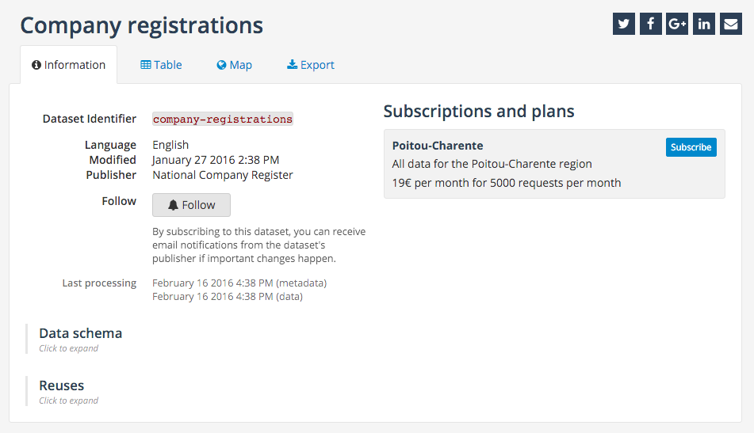
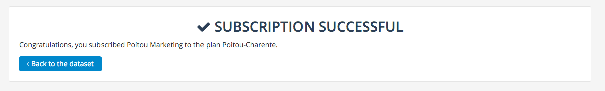
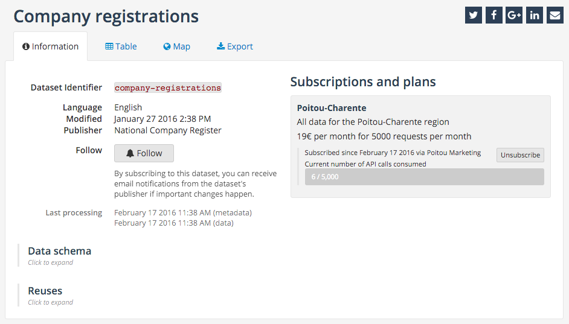
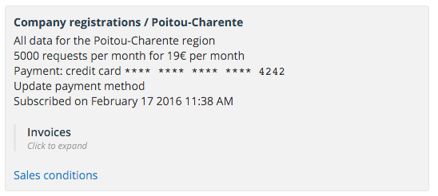
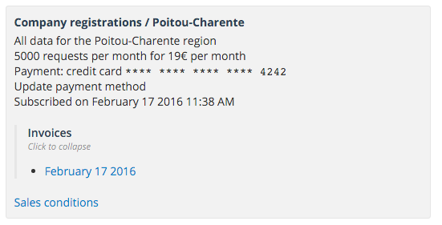
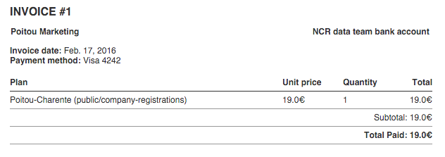
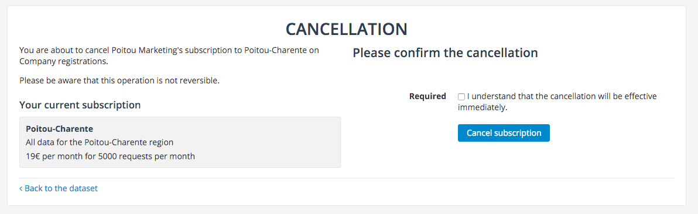
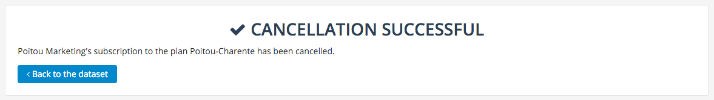

Subscriptions & invoices
========================

.. important::
   The billing feature is currently in private beta and therefore isn't available on all domains. If you'd like to
   take part in this beta, drop us an email at `support@opendatasoft.com <support@opendatasoft.com>`_.

In the :doc:`plans` section of the documenation, we followed a National Company Register creating plans, the seller's
viewpoint. In this section we'll assume the buyer's viewpoint, through a small (and fictitious marketing company called
Poitou Marketing) and its CEO, Michel Martin.

Subscribing to a plan
---------------------

We found a dataset containing relevant information for us, the list of all new company registrations. However the data
is 6 months old and we have to subscribe to get access to daily updated data. We therefore created an
:doc:`organization <organizations>` and added to it our corporate credit card, and we're now on the dataset's page.

On the information, we can now see a column entitled *Subscriptions and plans* which lists all available plans and our
current subscriptions (if any).

   The plan on the dataset's page.

We can now click on the *subscribe* button, which will bring us to a 3 step payment tunnel:

1. Selection of the subscriber (yourself as an individual or one of your organizations)

   .. image:: subscriptions__tunnel-step1--en.png
      :alt: Subscriber selection

2. Selection of the payment method

   .. image:: subscriptions__tunnel-step2--en.png
      :alt: Payment method selection

3. Confirmation

   .. image:: subscriptions__tunnel-step3--en.png
      :alt: Confirmation

Once this is done, you'll see a success message with a button bringing you back to the dataset.

On the dataset page, you'll see the plan you just subscribed to with this time an "unsubscribe" button, the date of
your subscription and more importantly the number of API calls relative to the plan's quota, allowing you to monitor
your own use of the plan.

Viewing your subscriptions
--------------------------

All the information relative to your subscriptions can be found on the subscriber's page, be it a user (in which case
you'll have to go to the *Payment methods and subscriptions* tab on your profile page) or an organization
(*subscriptions* section on the organization's page). In both cases, the subscription is represented in the same way.

   The standard subscription card.

On this card, you'll find a summary of both plan and subscription as well a link to the terms and conditions specified
by the organization selling the data and of course the invoices list.

Invoices
--------

When expanding the invoice section, you'll be presented with a list of chronologically sorted links to invoices.

A click on any of those link will open in a new window or tab the invoice itself, ready to be printed (if necessary).

.. note::
   Invoices are not immediately available, and it may take up to an hour for them to show up on the subscription's
   card.

Cancelling a subscription
-------------------------

There may be a point at which you're no longer interested in the data and may want to cancel your subscription. To do
so, you'll have to go to the dataset page, locate the subscription you want to cancel and click the *unsubscribe*
button. This will bring you to a confirmation page first and a success page that contains a link to the dataset.

These cancelled subscriptions do not disappear though. You'll still be able to find them next to your active
subscriptions in your profile or organization page.
